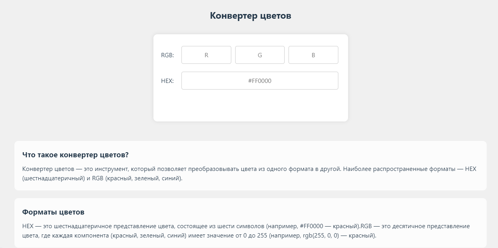

# Конвертер цветов

Конвертер цветов - это веб-приложение,которое позволяет конвертировать цвета между форматами RGB и HEX. Проект создан с использованием React и Vite.
Посмотреть демо можно по ссылке: [https://anastaciach.github.io/color-converter/](https://anastaciach.github.io/color-converter/)

## Возможности

- Конвертация из RGB в HEX.
- Конвертация из HEX в RGB.
- Автоматическое обновление фона при изменении цвета.
- Валидация вводимых значений (RGB: 0-255, HEX: 0-9 и A-F).
- Информация о форматах цветов и их использовании.

## Как использовать

1. Введите значения RGB (каждое значение от 0 до 255) в соответствующие поля, и HEX-значение будет автоматически рассчитано.
2. Введите HEX-значение (например, #FF0000), и RGB-значение будет автоматически рассчитано.
3. Фон страницы изменится в соответствии с выбранным цветом.
